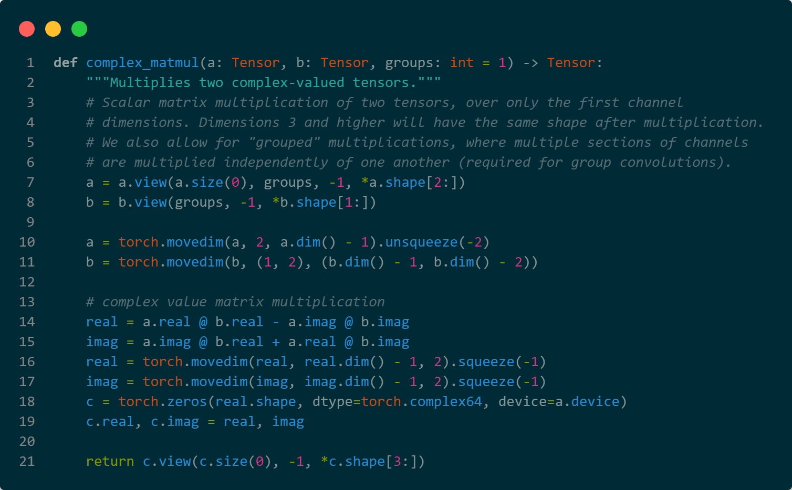

# README
This repository is a toy project to familiar myself with PyTorch C++ extension, aiming to implement FFT convolution in PyTorch.

## C++ Extension
It can be done easily by using [pybind11](https://pybind11.readthedocs.io/en/stable/index.html).
```cpp
// we use a separate file to define the extension
// in cusfft.cpp
#include "fftconv2d.h"  // the header file define the functions we want to export

namespace py = pybind11;

PYBIND11_MODULE(TORCH_EXTENSION_NAME, m) {
	m.doc() = "Convolution using FFT (CUDA)"; // add docstring

	py::module fft = m.def_submodule("fft", "Modules contain FFT functions"); // define a submodule
	fft.def("rfft", &rfft, "1D R2C FFT(CUDA)");
  ...
}
```

Then we write a `setup.py` to build the extension:
```py
from setuptools import setup
from torch.utils.cpp_extension import BuildExtension, CUDAExtension

setup(
    name='fftconv2d',
    version='0.1.0',
    ext_modules=[
        CUDAExtension('fftconv2d', [
            'fft.cu',
            ...
        ])
    ],
    cmdclass={'build_ext': BuildExtension}
)
```

After writing your extension, you should import it like the following:
```py
# import torch before your package, otherwise you will get an error
import torch
import your.package
```

## Convolution
We can learn how to do convolution throught FFT from [fft-conv-pytorch](https://github.com/fkodom/fft-conv-pytorch).
```python
# in fft_conv.py: 126,132
# Perform fourier convolution -- FFT, matrix multiply, then IFFT
signal_fr = rfftn(signal.float(), dim=tuple(range(2, signal.ndim)))
kernel_fr = rfftn(padded_kernel.float(), dim=tuple(range(2, signal.ndim)))

kernel_fr.imag *= -1
output_fr = complex_matmul(signal_fr, kernel_fr, groups=groups)
output = irfftn(output_fr, dim=tuple(range(2, signal.ndim)))
```

Refer to [Torch.Conv2d](https://pytorch.org/docs/stable/generated/torch.nn.Conv2d.html), we can learn that:
* `signal` is a 4D tensor with shape `(batch, in_channels, height, width)`
* `kernel` is a 4D tensor with shape `(out_channels, in_channels // groups, kernel_height, kernel_width)`

Now we describe the logic of the code above:
* Perform FFT on the last 2 dimensions, treat other dimensions as batches, we get `signal_fr` and `kernel_fr`.
* `kernel_fr.imag *= -1` is a conjegation operation.
* `complex_matmul` is to perform matrix multiplication on the last 2 dimesions of 2 tensors, treat other dimension as batches.

To learn more about `complex_matmul` in the code, we should learn how to do convolution on multiple channels.

To put it simple, assume we have the following parameters:
```js
batch: int = 1
in_channels: int = 2
out_channels: int = 2
groups: int = 1
signal: [batch, in_channels, in_height, in_width]
kernel: [out_channels, in_channels / groups, out_height, out_width]
```

Follow the convolution fomula in [Conv2d](https://pytorch.org/docs/stable/generated/torch.nn.Conv2d.html), we should apply the kernel to each in_channel, and then sum the results of them.

So our method is to:
* divide channels into groups when needed
* transform signal to `[batch, groups, in_height, in_width, in_channels / groups]`
* transform signal to `[groups, out_height, out_width, in_channels / groups, out_channels / groups]`
* perform matrix multiplication on the last 2 dimensions
* transform the result back to `[batch, out_channels, out_height, out_width]`

`fft-conv-pytorch` does this in the way described in the following picture:



Operations on dimensions include:
* [Tensor.view](https://pytorch.org/docs/stable/generated/torch.Tensor.view.html#torch.Tensor.view)
* [Tensor.movedim](https://pytorch.org/docs/stable/generated/torch.movedim.html)
* [Tensor.squeeze](https://pytorch.org/docs/stable/generated/torch.squeeze.html)

!!! warning `torch.matmul` only supports `torch.kFloat32`, to achieve complex multiplication, do it seperately.